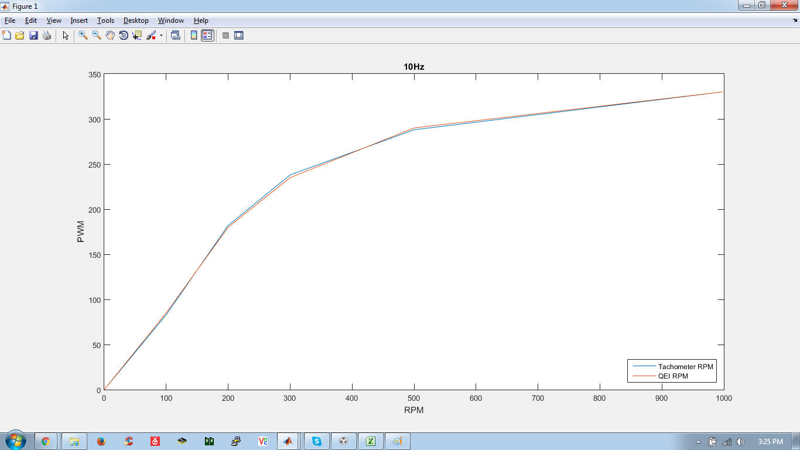
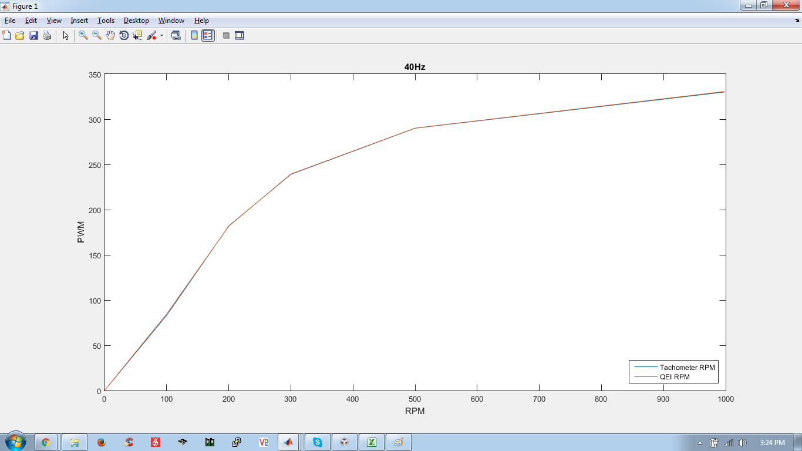
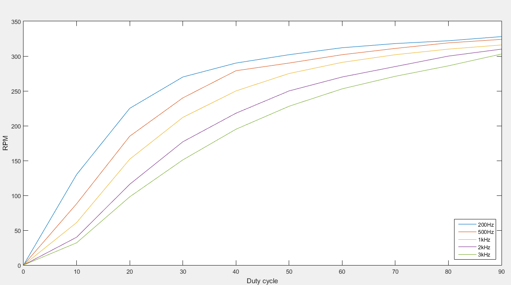

Experimental Data & Analysis
============================

In May - June 2016, the following experiments were conducted on the motors and robot to have a *"measured"* quality check on the modules of the lower and upper system.

The following schematic displays the zoomed in view of the lower control system with modules defined,

.. image:: ../images/module.png

So the aim and motive behind these experiments were to perfect these submodules that decide the fate of the system over and above just PID tuning. Parameters were tweaked and plots were studied to understand the modules' nature. 

RPM Calc
--------

 QEI (Quadrature Encoder Interface) is a special feature in Tiva TM4C123G Launchpad which is used to find RPM of wheels by reading quadrature signals from encoder over a given QEI frequency.

Scatter of RPM readings wrt QEI frequency
^^^^^^^^^^^^^^^^^^^^^^^^^^^^^^^^^^^^^^^^^

 **Aim** : To find out the optimal QEI frequency which gives fast rpm measures as well as less spread or fluctuations in RPM calculation.

 **Expectation** : We expect to determine the optimal and fastest frequency at which the feedback loop in the RPM control loop can be run. The bounds in which the system can get fast feedback as well as reliable.

 **GitHub repo** : /*GitHub repo link*/

 **Plots** :

.. |rpmspread1| image:: ../plots/SpreadOfRPM.png 

.. |rpmspread2| image:: ../plots/SpreadOfRPMKiel.png

+-----------------------------+-----------------------------+
|        |rpmspread1|         |        |rpmspread2|         |
+-----------------------------+-----------------------------+
|Plot from data gathered      | Plot from data gathered by  | 
|by Code Composer API code    | Kiel code used in Robocon 16|
+-----------------------------+-----------------------------+
|                         **Legend**                        |
+-----------+-----------------+-------------+---------------+
|Purple     | 10Hz            | Blue        | 4Hz(Robocon16)|   
+-----------+-----------------+-------------+---------------+
|Blue       | 20Hz            | Red         | 10Hz          |
+-----------+-----------------+-------------+---------------+
|Red        | 30Hz            | Yellow      | 20Hz          |
+-----------+-----------------+-------------+---------------+
|Yellow     | 40Hz            | Purple      | 30Hz          |		
+-----------+-----------------+-------------+---------------+
|           |                 | Green       | 40Hz          |
+-----------------------------+-------------+---------------+

 **Conclusions** : Lower frequency of QEI gives better results of RPM but one must maintain the balance so that the system response does not suffer.

Authenticity of RPM calc
^^^^^^^^^^^^^^^^^^^^^^^^

 **Aim** : To find the deviation in the plots of RPM from Tachometer and QEI
 
 **Expectation** : Coincidence of the two plots

 **GitHub repo** : /*GitHub repo link*/

 **Plots** :

+-----------------------------+-----------------------------+
|        |rpmcomp1|           |        |rpmcomp2|           |
+-----------------------------+-----------------------------+
|Plot from data gathered      | Plot from data gathered by  | 
|by running QEI at 10Hz       | running QEI at 40Hz         |
|                             | **with 44values average**   |
+-----------------------------+-----------------------------+

 **Conclusion** : Despite of the fact that higher QEi frequency skews the readings more, a moving array correction can give very authentic rpm measures.

Set PWM
-------
 
 This might not seem a very decisive factor but this is a hidden pain in the back. If you observe randomly generated PWM vs RPM graph then you will observe it is of the nature of a saturated positive slope graph. This means that with proportional increase in PWM, RPM might not increase that much. This would mean for the same error at higher RPM the control loop would have to work more to nullify error and work less at lower RPM as it is almost linear there. PWM frequency affects this factor a lot. So this study will be about its affect and also its affect on motor humming, heating, motor driver failure etc. 

Also the motor drivers have a upper limit on the PWM frequency they can take which can be found in its datasheet

Affect of PWM frequency on PWM vs RPM plots
^^^^^^^^^^^^^^^^^^^^^^^^^^^^^^^^^^^^^^^^^^^

 **Aim** : To plot and study the affect of PWM frequency on PWM vs RPM plots
 
 **Expectation** : To settle at a frequency which is under limits of motor driver and also gives satisfactory linear PWM vs RPM plot.

 **GitHub repo** : /*GitHub repo link*/

 **Plots** :

+-----------------------------+
|        |rpmpwm|             |
+-----------------------------+
|Plot from data gathered      |
|by running QEI at 10Hz       |
|                             |
+-----------------------------+

+--------------------------------------------------------------------------+
|**OBSERVATION TABLE**                                                     |
+---------------+---------------+---------------+---------------+----------+
|200Hz		|500Hz		|1kHz		|2kHz		|3kHz	   |
+-------+-------+-------+-------+-------+-------+-------+-------+-----+----+
|RPM	|PWM	|RPM	|PWM	|RPM	|PWM	|RPM	|PWM	|RPM  |PWM |
+-------+-------+-------+-------+-------+-------+-------+-------+-----+----+
|0	|0	|0	|0	|0	|0	|0	|0	|0    | 0  |
+-------+-------+-------+-------+-------+-------+-------+-------+-----+----+
|130	|4000	|88	|1600	|61	|800	|40	|400	|32   |266 |
+-------+-------+-------+-------+-------+-------+-------+-------+-----+----+
|225	|8000	|185	|3200	|152	|1600	|116	|800	|98   |532 |
+-------+-------+-------+-------+-------+-------+-------+-------+-----+----+
|270	|12000	|240	|4800	|212	|2400	|177	|1200	|151  |798 |
+-------+-------+-------+-------+-------+-------+-------+-------+-----+----+
|290	|16000	|279	|6400	|250	|3200	|218	|1600	|195  |1064|
+-------+-------+-------+-------+-------+-------+-------+-------+-----+----+
|302	|20000	|290	|8000	|275	|4000	|250	|2000	|228  |1330|
+-------+-------+-------+-------+-------+-------+-------+-------+-----+----+
|312	|24000	|302	|9600	|291	|4800	|270	|2400	|253  |1596|
+-------+-------+-------+-------+-------+-------+-------+-------+-----+----+
|318	|28000	|311	|11200	|302	|5600	|285	|2800	|271  |1862|
+-------+-------+-------+-------+-------+-------+-------+-------+-----+----+
|322	|32000	|319	|12800	|310	|6400	|300	|3200	|286  |2128|
+-------+-------+-------+-------+-------+-------+-------+-------+-----+----+
|328	|36000	|324	|14400	|316	|7200	|310	|3600	|303  |2394|
+-------+-------+-------+-------+-------+-------+-------+-------+-----+----+
|	|	|	|	|Humming|	|	|Less   |     |    |
|	|	|	|	|	|	|	|humming|     |    |
+-------+-------+-------+-------+-------+-------+-------+-------+-----+----+			
|I at10%| 0.17	|	 0.16	|	0.15	|	0.14	|      0.13|
+-------+-------+---------------+---------------+---------------+----------+
|I at90%|0.26	|	0.24	|	0.25	|	0.24	|      0.25|
+-------+-------+---------------+---------------+---------------+----------+

 **Conclusion** : Despite of the fact that higher QEI frequency skews the readings more, a moving array correction can give very authentic rpm measures.

 Higher frequency (kept in limit of Motor driver i.e. 3kHz in our case) linearizes the PWM vs RPM plot but at lower duty cycle for high frequency it affects torque of motor and also can lead heating of motor and motor driver							

 Motor heats at higher frequency due to inductance
							
Motor characteristcis
---------------------
 Motor characteristic graphs like N vs I :subscript:`a` , N vs T etc were observed and plotted and put in an excel sheet to help as reference for the customized motor driver designers of the team. The srpeadsheet can be found :download:`here <../downloads/MotorCharacteristics-1.xlsx>`

Motor hysteresis
----------------
